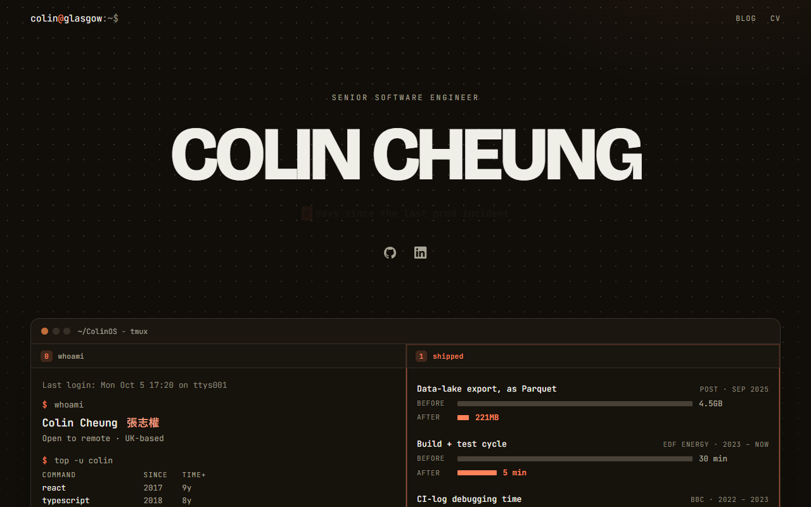

<div align="center">

# colincheung.dev

**A terminal-native personal site and engineering blog.**

**▶ Live: [colincheung.dev](https://colincheung.dev)** · [Blog](https://colincheung.dev/blog) · [CV](https://colincheung.dev/cv)

[](https://github.com/ColinCee/astro-blog/actions/workflows/deploy.yml?query=branch%3Amain)
[](https://colincheung.dev)



</div>

## What it does

- Terminal-inspired homepage with a dark terminal window
- Technical blog written as Markdown content collections, with Expressive Code blocks
- Printable CV page that prints clean to ink-on-white
- Light and dark themes that follow the system setting
- Sitemap generated at build time

## Stack

| Area | Tooling |
| --- | --- |
| Framework | Astro |
| Content | Markdown content collections |
| Code blocks | Astro Expressive Code |
| Styling | Custom CSS tokens in `src/styles/terminal.css` |
| Hosting | Cloudflare Workers |
| Deploys | GitHub Actions + Wrangler |

## Run locally

```sh
npm install
npm run dev
```

## How it works

Astro builds the pages in `src/pages/` and the posts in `src/content/blog/`, styled with a small custom design system, and deploys them to Cloudflare Workers through the Cloudflare adapter. [DESIGN.md](DESIGN.md) owns the visual system and [PRODUCT.md](PRODUCT.md) the audience and purpose.

## Project structure

```text
src/pages/          Route pages: home, CV, blog index, blog posts
src/content/blog/   Markdown blog posts
src/layouts/        Shared page and post shells
src/components/     Shared navigation, footer, date formatting
src/styles/         Global design tokens and base styles
public/             Static assets copied into the deployed build
```

## Commands

| Command | Action |
| --- | --- |
| `npm install` | Install dependencies |
| `npm run dev` | Start the local dev server |
| `npm run build` | Build the production site |
| `npm run check` | Build, type-check, and run a Wrangler dry-run deploy |
| `npm run deploy` | Build and deploy to Cloudflare Workers |
| `npm run types` | Regenerate Cloudflare Worker types |
| `npm test` | Run Playwright layout and typography tests |

## Deployment

Pushes to `main` run `.github/workflows/deploy.yml`, which installs dependencies, builds the site, runs TypeScript, validates the Wrangler bundle, and deploys with Cloudflare secrets.

Required repository secrets:

```text
CLOUDFLARE_ACCOUNT_ID
CLOUDFLARE_API_TOKEN
```

`public/.assetsignore` is intentionally kept so Wrangler does not upload Worker internals like `_worker.js` as static assets.
